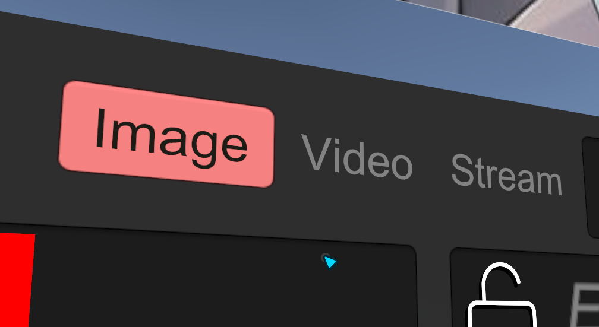

# Multimedia-content-in-a-single-URL

I have made modifications to the system, enabling it to process both videos and images within the same text. By pasting a URL, the system will automatically detect and categorize the content as either a video or an image. check out our [VCC-listing](https://hppedeaf.github.io/Multimedia-content-in-a-single-URL/) repo.

## ▶ How Work ?

https://github.com/user-attachments/assets/6e468932-3d39-4690-b9b4-5ddb64932794
